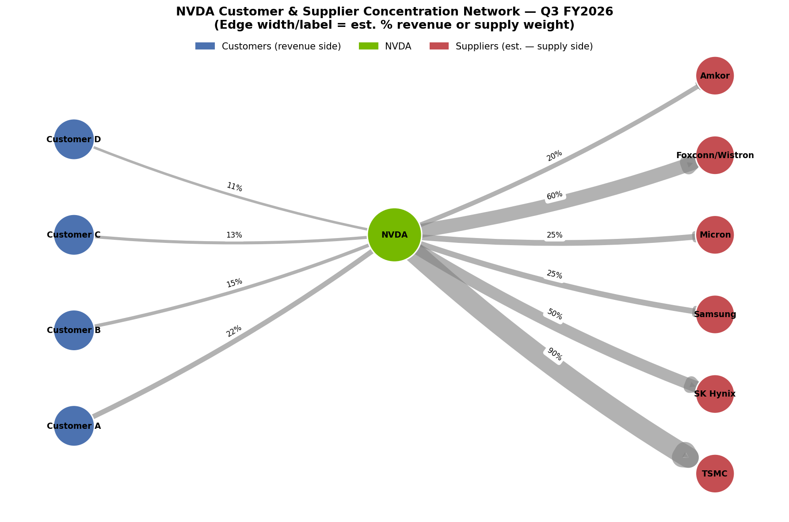

# NVIDIA Customer & Supply-Chain Concentration Risk Analysis

A Python tool that quantifies NVIDIA's customer revenue concentration and
supply-chain geographic exposure using disclosures pulled from public SEC
filings — the kind of concentration-risk screen a credit, equity research,
or PE diligence analyst would run as part of a company deep-dive.



## Key Finding

NVIDIA's disclosed ≥10%-revenue customers went from **25% combined revenue
concentration in Q2 FY2025 to 61% in Q3 FY2026** — more than doubling in
about a year. At the same time, the company's production is itself narrowly
concentrated: foundry capacity runs almost entirely through TSMC in Taiwan,
and advanced HBM memory sourcing is split across a small number of
qualified suppliers based mostly in South Korea.

That's a **dual-sided concentration risk**: revenue depends on a handful of
hyperscale customers, while supply depends on a handful of counterparties
concentrated in two geographies with real geopolitical tail risk (Taiwan
Strait tensions, and U.S.–China export controls that have already
constrained a previously significant revenue market).

Full auto-generated memo: [`nvda_risk_memo.txt`](nvda_risk_memo.txt)

## What This Project Does

1. **Pulls documented customer concentration data** from NVIDIA's FY2026
   10-K and Q2/Q3 FY2026 10-Q filings (customers representing ≥10% of
   total revenue, as required SEC disclosure)
2. **Computes concentration metrics** — combined top-customer revenue %,
   a simplified Herfindahl-Hirschman Index (HHI) on disclosed customers
3. **Maps estimated supply-chain geographic exposure** across NVIDIA's
   known foundry, memory, and packaging/assembly partners
4. **Flags risk thresholds** using rule-based logic (e.g., >30% customer
   concentration, >50% single-country supplier exposure)
5. **Auto-generates a written risk summary memo**
6. **Visualizes the full network** — customers and suppliers as nodes
   around NVDA, edge width scaled to revenue/supply weight

## Data Sources & Important Limitations

| Data | Source | Reliability |
|---|---|---|
| Customer concentration (%) | NVIDIA 10-K / 10-Q filings via SEC EDGAR | High — directly disclosed, required by SEC rules |
| Supplier identities (TSMC, SK Hynix, etc.) | Public industry reporting | High — well-documented relationships |
| Supplier *weights* (% reliance) | Analyst estimates | **Low-medium — NVIDIA does not publicly disclose exact supplier volume splits** |

This is an important honesty point built into the project on purpose: the
customer-side analysis is fully grounded in disclosed, auditable numbers.
The supplier-side weightings are estimates based on public reporting, not
confirmed trade data, and the code and memo both flag this explicitly
rather than presenting estimates as fact. A real diligence analyst would
draw this same distinction.

## Repo Structure

```
nvda_supply_chain/
├── nvda_risk_mapper.py              # main script — data, analytics, visualization
├── nvda_network_graph.png           # generated network visualization
├── nvda_risk_memo.txt               # generated risk summary memo
├── nvda_customer_concentration.csv  # sourced customer disclosure data
├── nvda_supplier_estimates.csv      # supplier weight estimates + confidence notes
├── requirements.txt
└── README.md
```

## How to Run

```bash
pip install -r requirements.txt
python nvda_risk_mapper.py
```

This regenerates the network graph, the CSVs, and the risk memo from the
data hardcoded in `nvda_risk_mapper.py`.

## Tech Stack

- **Python** — pandas (data wrangling), NetworkX (relationship graph),
  Matplotlib (visualization)
- **Data**: SEC EDGAR filings (10-K / 10-Q), public industry reporting

## Planned Improvements

- [ ] Replace hardcoded filing data with a live call to the [SEC EDGAR
      full-text search API](https://www.sec.gov/edgar/search/) so the tool
      auto-pulls the latest customer concentration disclosures for any
      ticker, not just NVDA
- [ ] Integrate a real trade-data API (e.g., ImportGenius, Panjiva) to
      replace supplier weight estimates with actual shipment-level data
- [ ] Generalize the script to accept any ticker as a CLI argument
- [ ] Add historical trend charts (concentration % over multiple quarters)

## Why This Project

Built as a demonstration of the kind of concentration/geopolitical risk
screen used in credit analysis, equity research, and PE/credit diligence —
turning a SEC filing disclosure that's easy to skim past into a
quantified, visualized risk assessment.
